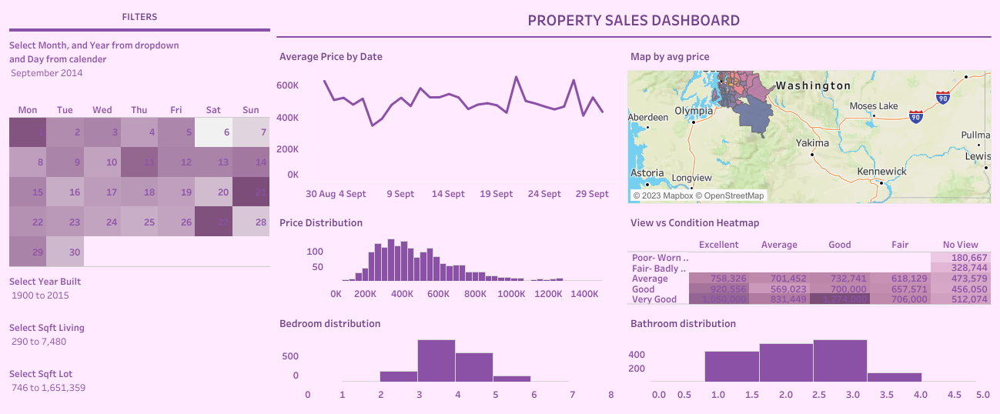

# Housing Sales Analysis

## Overview

This repository contains a dashboard for analyzing King County, Washington housing sales data. The dashboard provides visual insights into the sales price, bedroom, bathroom distributions
## Features

- Visual representations of housing sales data
- Interactive charts and graphs
- Filter options for customized analysis

## Dashboard Preview

## Dashboard Components

### 1. Sales Overview
This section provides an overview of total sales, average prices, and trends over time.

### 2. Regional Analysis
Visualizes sales distribution across different regions with interactive maps and charts.

### 3. Property Types
Analyzes sales based on house properties such as year built, numbers of bedrooms and bathrooms, waterfront etc.

## Technologies Used

- Tableau

